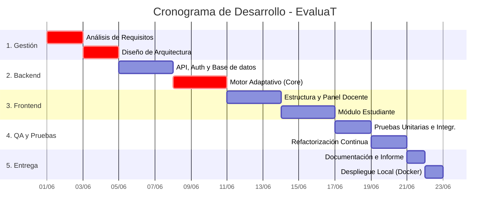

# Triángulo de Hierro: Alcance y Costos - Proyecto EvaluaT

## 2.1 Alcance (EDT — Estructura de Desglose del Trabajo)

El alcance del proyecto **EvaluaT** comprende el diseño, desarrollo, pruebas y documentación de una línea de producto de software para la gestión y aplicación de exámenes adaptativos. No se incluye dentro del alcance la puesta en producción en servidores en la nube físicos (se entregará preparado mediante contenedores Docker para despliegue local).

A continuación, se detalla la **Estructura de Desglose del Trabajo (EDT)**, descomponiendo el trabajo en entregables y actividades principales:

**1. Gestión y Planificación del Proyecto**
*   **1.1 Análisis de Requisitos:** Levantamiento de historias de usuario para los roles `Teacher` y `Student`.
*   **1.2 Diseño de Arquitectura:** Elaboración de diagramas de componentes, flujo de datos y definición de la arquitectura limpia.
*   **1.3 Planificación Estratégica:** Definición del triángulo de hierro, cronogramas y selección de metodologías.

**2. Desarrollo Backend (ASP.NET Core API & Dominio)**
*   **2.1 Configuración Base e Infraestructura:** Configuración de la solución `.sln`, inyección de dependencias y contenedor Docker con PostgreSQL.
*   **2.2 Módulo de Seguridad (Identity & Auth):** Implementación de autenticación mediante JWT, middlewares de seguridad y autorización basada en roles.
*   **2.3 Gestión del Banco de Preguntas:** Desarrollo de operaciones CRUD para preguntas y alternativas, abarcando repositorios, casos de uso y controladores.
*   **2.4 Motor de Exámenes Adaptativos (Core):**
    *   Implementación de las estrategias de ajuste de dificultad (`Balanced`, `Conservative`) utilizando el patrón *Strategy*.
    *   Manejo algorítmico de selección de preguntas no repetidas según el histórico de la sesión.

**3. Desarrollo Frontend (React, TypeScript & Vite)**
*   **3.1 Estructura y Enrutamiento:** Configuración del proyecto, enrutador protegido (Protected Routes) y diseño del layout base.
*   **3.2 Módulo Docente (Dashboard Administrativo):**
    *   Interfaz para visualizar y gestionar bancos de preguntas.
    *   Panel de configuración de políticas de evaluación.
    *   Visor de resultados y reportes de sesiones de estudiantes.
*   **3.3 Módulo Estudiante:**
    *   Interfaz de inicio de sesión de examen.
    *   Renderizado dinámico de la pregunta actual, indicador de dificultad (Badge) y captura de respuestas en tiempo real.

**4. Aseguramiento de Calidad (QA) y Refactorización**
*   **4.1 Pruebas Unitarias (TDD):** Desarrollo de pruebas sobre las reglas del dominio y el motor adaptativo (cobertura objetivo mínima: 70%).
*   **4.2 Pruebas de Integración:** Verificación del flujo completo del examen y acceso a base de datos en memoria (`SQLite`).
*   **4.3 Refactorización Continua:** Aplicación de patrones de diseño (Factory, Observer) y mejora de la mantenibilidad del código.

**5. Documentación y Entrega**
*   **5.1 Informe Técnico:** Creación de documentos sustento, anexos y diagramas del sistema.
*   **5.2 Manuales de Ejecución:** Archivos `README.md` listos para la ejecución vía `docker-compose`.

---

## 2.2 Estimación de Costos

La viabilidad del proyecto requiere una estimación precisa de los recursos técnicos, operativos y humanos. Basándonos en la estimación inicial de esfuerzo de 78 horas, a continuación se desglosan los costos asociados asumiendo tarifas estándar para perfiles técnicos en un entorno de desarrollo de software a medida.

### 2.2.1 Recursos Humanos (RR.HH.)
Se requiere un equipo multidisciplinario (o perfiles asumidos en roles) para cubrir las diferentes etapas. Las horas reflejan el trabajo concentrado de desarrollo.

| Rol / Perfil | Actividades Asignadas | Horas Asignadas | Tarifa Hora (Bs.) | Costo Subtotal (Bs.) |
| :--- | :--- | :---: | :---: | :---: |
| **Arquitecto / Analista** | Toma de requisitos, Diseño de arquitectura, TDD inicial y Documentación final. | 24 h | 60.00 Bs. | 1,440.00 Bs. |
| **Desarrollador Full-Stack** | Desarrollo de la API, React, Motor Adaptativo, CRUDs y Refactorización. | 44 h | 45.00 Bs. | 1,980.00 Bs. |
| **Ingeniero QA / Pruebas** | Ejecución de pruebas unitarias, integración y validación de cobertura. | 10 h | 35.00 Bs. | 350.00 Bs. |
| **Total RR.HH.** | | **78 h** | | **3,770.00 Bs.** |

### 2.2.2 Recursos Técnicos y Operativos
Aunque el proyecto utiliza predominantemente tecnologías de código abierto (*Open Source*), se imputan costos operativos estándar relacionados con el ambiente de trabajo y posibles herramientas secundarias.

| Ítem | Descripción de Uso | Costo Estimado (Bs.) |
| :--- | :--- | :---: |
| **Licencias y Herramientas** | Visual Studio Code, Docker Desktop, Node.js, .NET SDK (Todos gratuitos/Open Source). | 0.00 Bs. |
| **Infraestructura de Desarrollo** | Amortización de equipos de cómputo y consumo de servicios (electricidad, internet) durante las 78 horas. | 250.00 Bs. |
| **Servicios de Repositorio** | GitHub / GitLab para control de versiones y CI/CD básico (Tier gratuito). | 0.00 Bs. |
| **Total Técnicos y Operat.** | | **250.00 Bs.** |

### 2.2.3 Resumen Presupuestal
Para garantizar el cumplimiento dentro del presupuesto, se añade un margen de contingencia para desviaciones en el desarrollo del motor adaptativo (riesgo algorítmico).

| Categoría | Total Estimado (Bs.) |
| :--- | :--- |
| **Costo Total Recursos Humanos** | 3,770.00 Bs. |
| **Costo Total Recursos Operativos** | 250.00 Bs. |
| **Subtotal Base** | **4,020.00 Bs.** |
| Margen de Contingencia (10%) | 402.00 Bs. |
| **PRESUPUESTO TOTAL ESTIMADO** | **4,422.00 Bs.** |

*Nota: Esta estructura asume que el tiempo del desarrollador y la gestión son costos cuantificables, ideal para presentar la viabilidad económica del producto informático en un entorno profesional, académico o comercial.*

---

## 2.3 Cronograma (Tiempo) - Diagrama de Gantt

Para completar el **Triángulo de Hierro (Alcance, Costo, Tiempo)**, a continuación se presenta el cronograma del proyecto distribuido secuencialmente según las 5 fases de nuestra EDT.

El esfuerzo total de 78 horas se ha distribuido en un calendario ágil (aprox. 3 semanas de desarrollo), asumiendo jornadas de trabajo parciales comunes en entornos académicos o de desarrollo independiente:

