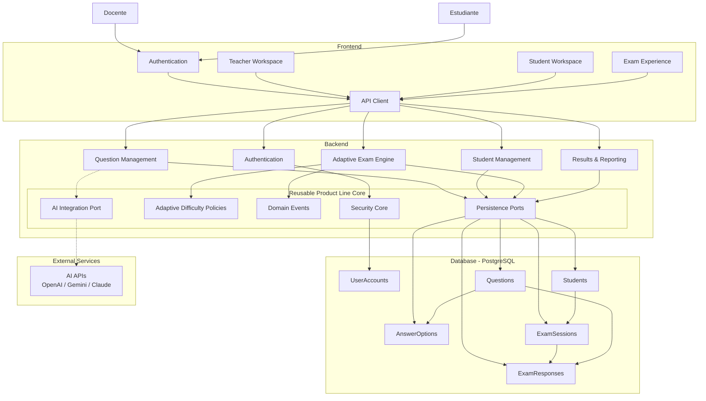

# Diagrama de Componentes - EvaluaT

```mermaid
flowchart TB
    Docente["Docente"]
    Estudiante["Estudiante"]

    subgraph Frontend["Frontend"]
        AuthenticationUI["Authentication"]
        TeacherUI["Teacher Workspace"]
        StudentUI["Student Workspace"]
        ExamUI["Exam Experience"]
        ApiClient["API Client"]
    end

    subgraph Backend["Backend"]
        Authentication["Authentication"]
        QuestionManagement["Question Management"]
        StudentManagement["Student Management"]
        AdaptiveExamEngine["Adaptive Exam Engine"]
        Reporting["Results & Reporting"]

        subgraph ProductLineCore["Reusable Product Line Core"]
            SecurityCore["Security Core"]
            AdaptivePolicies["Adaptive Difficulty Policies"]
            DomainEvents["Domain Events"]
            PersistencePorts["Persistence Ports"]
            AiIntegrationPort["AI Integration Port"]
        end
    end

    subgraph Database["Database - PostgreSQL"]
        UserAccounts["UserAccounts"]
        Students["Students"]
        Questions["Questions"]
        AnswerOptions["AnswerOptions"]
        ExamSessions["ExamSessions"]
        ExamResponses["ExamResponses"]
    end

    subgraph ExternalServices["External Services"]
        AiApis["AI APIs\nOpenAI / Gemini / Claude"]
    end

    Docente --> AuthenticationUI
    Estudiante --> AuthenticationUI
    AuthenticationUI --> ApiClient
    TeacherUI --> ApiClient
    StudentUI --> ApiClient
    ExamUI --> ApiClient

    ApiClient --> Authentication
    ApiClient --> QuestionManagement
    ApiClient --> StudentManagement
    ApiClient --> AdaptiveExamEngine
    ApiClient --> Reporting

    Authentication --> SecurityCore
    QuestionManagement --> PersistencePorts
    StudentManagement --> PersistencePorts
    AdaptiveExamEngine --> AdaptivePolicies
    AdaptiveExamEngine --> DomainEvents
    AdaptiveExamEngine --> PersistencePorts
    Reporting --> PersistencePorts
    QuestionManagement -.-> AiIntegrationPort

    SecurityCore --> UserAccounts
    PersistencePorts --> Students
    PersistencePorts --> Questions
    PersistencePorts --> AnswerOptions
    PersistencePorts --> ExamSessions
    PersistencePorts --> ExamResponses

    Students --> ExamSessions
    Questions --> AnswerOptions
    ExamSessions --> ExamResponses
    Questions --> ExamResponses

    AiIntegrationPort -.-> AiApis
```
