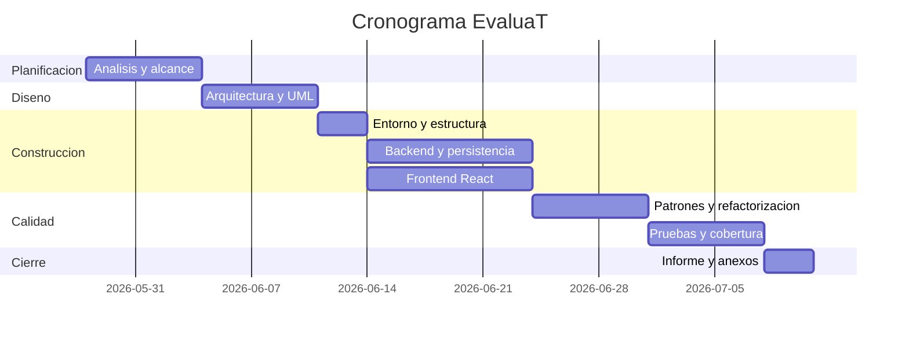
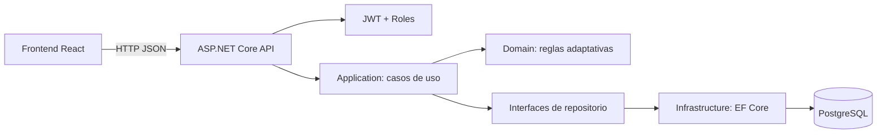
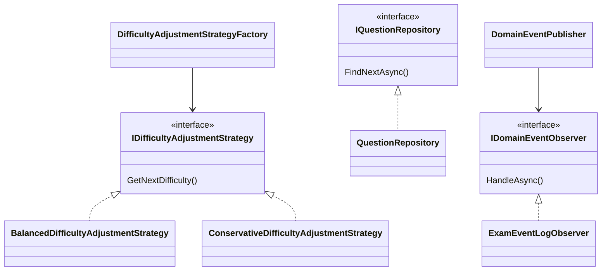

# Informe Técnico: EvaluaT

## 1. Introducción

**Contexto general del proyecto:**
EvaluaT es una línea de producto de software diseñada para gestionar y aplicar exámenes adaptativos. En el entorno educativo actual, la personalización de la evaluación es fundamental para medir de forma precisa y eficiente el conocimiento del estudiante, ajustándose a su nivel a medida que responde.

**Problema identificado:**
Los exámenes tradicionales estáticos a menudo no logran medir con exactitud el nivel real de conocimiento, frustrando a los estudiantes con menor dominio del tema y no representando un reto para los más avanzados. Además, gestionar grandes bancos de preguntas y analizar los resultados manualmente supone una gran carga laboral para los docentes.

**Objetivos del proyecto:**
- Desarrollar un sistema de exámenes adaptativos donde la dificultad de las preguntas se ajusta dinámica y automáticamente según las respuestas previas del estudiante.
- Proveer un panel administrativo para que los docentes gestionen el banco de preguntas, configuren las políticas de adaptación y monitoreen los resultados de las sesiones.
- Implementar una plataforma robusta, escalable y segura utilizando una arquitectura limpia, separando claramente los roles de usuario (`Teacher` y `Student`).

**Importancia del informe:**
Este informe técnico es fundamental porque establece las bases metodológicas, arquitectónicas y de planificación del proyecto EvaluaT. Sirve como guía principal para el equipo de desarrollo, justificando las decisiones de diseño, los patrones utilizados y asegurando que se cumplan tanto los requisitos funcionales como los estándares de calidad esperados.

## 2. Planificación del Proyecto

El desarrollo del proyecto EvaluaT se organizará bajo un enfoque modular y estructurado antes de iniciar la etapa de codificación. La planificación asegura que todos los requisitos sean entendidos, y que el esfuerzo se distribuya adecuadamente entre los componentes del sistema (Frontend, Backend, y Base de Datos).

El proyecto, de una duración estimada controlada, se divide en iteraciones que van desde el diseño temprano y establecimiento de la arquitectura base, seguido del desarrollo de los casos de uso principales, para finalmente cerrar con las fases de refactorización, control de calidad y despliegue local mediante contenedores.

### 2.1 Alcance (EDT — Estructura de Desglose del Trabajo)

El alcance del proyecto cubre la creación integral de la aplicación web EvaluaT. A continuación, se presenta cómo se descompone el trabajo en los entregables principales:

```text
1. EvaluaT
|-- 1.1 Gestión y Planificación
|   |-- 1.1.1 Análisis de Requisitos y EDT
|   |-- 1.1.2 Arquitectura y Diseño del Sistema
|
|-- 1.2 Desarrollo Backend (ASP.NET Core API)
|   |-- 1.2.1 Configuración de Infraestructura y Base de datos (PostgreSQL)
|   |-- 1.2.2 Módulo de Seguridad (Autenticación JWT, Roles Estudiante/Docente)
|   |-- 1.2.3 Gestión del Banco de Preguntas (CRUD)
|   |-- 1.2.4 Lógica de Dominio del Examen Adaptativo (Motor de ajuste de dificultad)
|
|-- 1.3 Desarrollo Frontend (React, TypeScript, Vite)
|   |-- 1.3.1 Login Seguro y Enrutamiento por Roles
|   |-- 1.3.2 Panel Docente (Gestión de preguntas y resultados)
|   |-- 1.3.3 Panel Estudiante e Interfaz del Examen Adaptativo
|
|-- 1.4 Calidad y Pruebas
|   |-- 1.4.1 Pruebas Unitarias del Motor Adaptativo y Dominio
|   |-- 1.4.2 Pruebas de Integración y Mocks (SQLite en memoria / Coverlet)
|   |-- 1.4.3 Revisión de Código y Aplicación de Patrones de Diseño
|
`-- 1.5 Documentación y Conformidad
    |-- 1.5.1 Informe Técnico y Diagramas (Arquitectura, Cronogramas)
    |-- 1.5.2 Documentación de Refactorización y Pruebas
```

### 2.2 Estimacion de costos

| Actividad | Horas |
| --- | ---: |
| Analisis y planificacion | 8 |
| Diseno de arquitectura | 10 |
| Desarrollo CRUD/API | 24 |
| Motor adaptativo y patrones | 12 |
| Refactorizacion documentada | 8 |
| Pruebas | 10 |
| Documentacion | 6 |
| Total | 78 |

### 2.3 Cronograma Gantt



## 3. Metodología de desarrollo

Para la construcción de EvaluaT, es fundamental elegir un marco de trabajo que se adapte a su alcance cerrado, sus requerimientos específicos y la duración controlada del proyecto. Se evaluaron dos enfoques principales: el modelo tradicional en Cascada y un marco de trabajo Ágil (Scrum Ligero).

### 3.1 Tabla Comparativa de Metodologías

| Metodología | Ventajas | Limitaciones | Idoneidad para EvaluaT |
| :--- | :--- | :--- | :--- |
| **Cascada (Waterfall)** | - Fases claramente definidas, secuenciales y bien documentadas.<br>- Fácil de planificar y presupuestar desde el inicio.<br>- Ideal cuando los requisitos no van a mutar. | - Escasa flexibilidad a cambios tardíos.<br>- El software completamente funcional se entrega al final de la línea de tiempo. | **Alta:** El proyecto cuenta con requisitos estables y el número de políticas de evaluación adaptativa ya está cerrado (`Balanced` y `Conservative`). |
| **Agilidad (Ej. Scrum)** | - Desarrollo iterativo e incremental.<br>- Permite ajustes rápidos a requerimientos cambiantes. | - Sobrecarga de roles, reuniones (ceremonias) y planeaciones que no justifican el tamaño del proyecto. | **Baja:** La complejidad de los requerimientos y el alcance no varían lo suficiente para justificar iteraciones y cambios constantes de rumbo. |

### 3.2 Justificación de la Elección: Cascada (Waterfall)

Se seleccionó la **Metodología en Cascada** como enfoque rector para el proyecto por las siguientes razones:

1. **Requisitos Estáticos y Bien Definidos:** La lógica adaptativa central no cambiará de rumbo a medio proyecto. Solo se requieren dos estrategias de dificultad específicas y claramente detalladas. No hay "peticiones sorpresa" durante el ciclo de vida.
2. **Documentación Clara y Entregables Previos:** En entornos formativos o comerciales con fechas de entrega inamovibles, Cascada favorece terminar la diagramación arquitectónica previa antes de escribir la primera línea de código, evitando retrabajos estructurales.
3. **Escala y Esfuerzo Fijo:** El proyecto está cronometrado a 78 horas estimadas de cierre; avanzar por las fases de *Diseño* -> *Construcción* -> *Pruebas* es lineal y predictible, haciendo innecesaria una gestión iterativa.
4. **Sinergia con Prácticas de Ingeniería Estables:** Permite diseñar los tests para pruebas unitarias de manera estructurada una vez concluida la etapa de análisis de requerimientos del motor.

## 4. Descripcion del caso de estudio

El docente controla el banco de preguntas y consulta resultados. El estudiante inicia una sesion de examen. El sistema entrega una pregunta inicial segun la politica seleccionada. Cada respuesta recalcula la dificultad siguiente y selecciona una nueva pregunta no repetida hasta completar la sesion.

## 5. Arquitectura del sistema



## 6. Reutilizacion de componentes

Desde la perspectiva de ingenieria de software, EvaluaT aplica reutilizacion mediante componentes genericos, contratos estables y puntos de variabilidad. Esto se relaciona con el enfoque de **lineas de productos de software**, donde se construye un nucleo comun que puede adaptarse a proyectos similares, por ejemplo sistemas de examenes, plataformas de evaluacion, bancos de preguntas, simuladores de pruebas o sistemas de entrenamiento adaptativo.

La reutilizacion no se limita a copiar codigo. En este proyecto se reutilizan frameworks, librerias, patrones arquitectonicos y modulos funcionales que encapsulan responsabilidades especificas. Esto permite reducir esfuerzo, mejorar mantenibilidad y facilitar nuevas variantes del producto sin redisenar toda la solucion.

| Activo reutilizable | Tipo de reutilizacion | Por que se reutiliza |
| --- | --- | --- |
| Arquitectura frontend/backend | Reutilizacion arquitectonica | Separa UI, API, dominio y persistencia. Esta estructura puede usarse en otros sistemas web con usuarios, reglas de negocio y base de datos. |
| React + TypeScript | Framework/lenguaje reutilizable | Permite construir interfaces por componentes, tipar contratos de datos y reutilizar pantallas, formularios, estados y clientes HTTP. |
| ASP.NET Core Web API | Framework backend reutilizable | Provee una base estandar para exponer servicios REST, manejar controladores, autenticacion, autorizacion, middleware y configuracion. |
| Entity Framework Core + PostgreSQL | Persistencia reutilizable | Abstrae el acceso a datos mediante entidades y contexto de base de datos. Puede reutilizarse cambiando entidades o motor de base de datos. |
| Authentication | Modulo funcional reutilizable | Centraliza login, registro, roles y emision de tokens. Puede reutilizarse en cualquier producto que requiera acceso por perfiles de usuario. |
| Question Management | Modulo funcional reutilizable | Gestiona preguntas, opciones, dificultad y estado activo. Es aplicable a examenes academicos, encuestas evaluativas o bancos de practicas. |
| Student Management | Modulo funcional reutilizable | Administra estudiantes como entidad base. Puede adaptarse a participantes, candidatos, usuarios de entrenamiento o evaluados. |
| Adaptive Exam Engine | Modulo de dominio reutilizable | Contiene el flujo de inicio de examen, respuesta, calculo de puntaje y seleccion de siguiente pregunta. Es el nucleo comun para productos de evaluacion adaptativa. |
| Adaptive Difficulty Policies | Punto de variabilidad | Permite cambiar la forma en que el sistema ajusta la dificultad. En una linea de producto pueden existir politicas balanceadas, conservadoras, agresivas o personalizadas. |
| Repository + Unit of Work | Patron reutilizable | Desacopla los casos de uso de la base de datos. Facilita pruebas, cambios de almacenamiento y evolucion independiente de la infraestructura. |
| Domain Events | Mecanismo extensible | Permite reaccionar a eventos del examen sin acoplar el nucleo. Puede reutilizarse para auditoria, notificaciones, analitica o integracion con otros sistemas. |
| Security Core | Componente transversal reutilizable | Agrupa autenticacion JWT, autorizacion por roles y hashing de contrasenas. Es comun a multiples productos que requieran seguridad basica. |
| UI Components | Reutilizacion de interfaz | Componentes visuales como metricas, badges, paneles y estados pueden usarse en distintas pantallas para mantener consistencia visual. |
| API Client | Componente de integracion reutilizable | Centraliza llamadas HTTP, token JWT y manejo de errores. Puede ampliarse para consumir nuevos endpoints sin duplicar logica. |
| AI Integration Port | Punto de extension reutilizable | Permite integrar proveedores como OpenAI, Gemini o Claude para generar preguntas, sugerir opciones o analizar dificultad sin acoplar el dominio a un proveedor concreto. |

En terminos de linea de producto, EvaluaT puede entenderse como una **base comun** para construir variantes. El nucleo reutilizable incluye autenticacion, gestion de usuarios, banco de preguntas, motor de examen, persistencia y reglas adaptativas. Las variaciones se concentran en puntos especificos: politicas de dificultad, tipo de usuario, tipo de evaluacion, proveedor de IA, criterios de calificacion y presentacion visual.

Por ejemplo, el mismo nucleo podria reutilizarse para una plataforma de evaluacion universitaria, una app de certificaciones tecnicas o un sistema de entrenamiento con preguntas generadas por IA. En cada caso no seria necesario reescribir toda la aplicacion; se reemplazarian o extenderian los modulos variables manteniendo los componentes base.

## 7. Refactorizacion aplicada

Durante el desarrollo se identificaron problemas de mantenibilidad, acoplamiento y extensibilidad que podian afectar la calidad del sistema a medida que crecieran los casos de uso. La refactorizacion se aplico para reducir bad smells, separar responsabilidades y preparar el producto para nuevas variantes, especialmente en el motor adaptativo y en la persistencia.

La clasificacion de bad smells se limita a las familias revisadas en teoria avanzada: **Infladores**, **Maltratadores de objetos**, **Previsores de cambio**, **Emparejadores** y **Dispensables**.

| Problema detectado | Familia de bad smell | Bad smell asociado | Mejora aplicada | Impacto en la calidad |
| --- | --- | --- | --- | --- |
| La seleccion de la siguiente pregunta estaba mezclada con el flujo principal del examen. | Infladores | Metodo largo / metodo con demasiadas responsabilidades. | Se aplico Extract Method para aislar la busqueda con fallback en una operacion dedicada. | Mejora la legibilidad, reduce duplicacion y permite probar la seleccion de preguntas de forma independiente. |
| La politica de dificultad podia crecer mediante condicionales `if/else` o `switch`. | Maltratadores de objetos | Uso excesivo de condicionales en lugar de polimorfismo. | Se aplico Replace Conditional with Strategy usando politicas intercambiables. | Permite agregar nuevas politicas sin modificar el caso de uso principal, cumpliendo Open/Closed Principle. |
| Los casos de uso podian depender directamente de la base de datos. | Emparejadores | Acoplamiento fuerte entre aplicacion e infraestructura. | Se aplico Extract Interface mediante repositorios y unidad de trabajo. | Desacopla dominio/aplicacion de infraestructura, facilita pruebas y permite cambiar persistencia. |
| La logica de autenticacion, roles y token podia quedar dispersa. | Dispensables | Codigo duplicado o logica repetida en distintos puntos. | Se centralizo en un modulo de Authentication y en componentes de seguridad reutilizables. | Aumenta cohesion, reduce errores de seguridad y facilita reutilizacion en proyectos similares. |
| Los errores HTTP podian manejarse de forma distinta en cada endpoint. | Dispensables | Codigo repetido para manejo manual de excepciones. | Se incorporo manejo transversal mediante middleware de excepciones. | Entrega respuestas mas consistentes, mejora depuracion y reduce codigo repetido. |
| La UI podia repetir estructuras visuales para metricas, badges y paneles. | Dispensables | Duplicacion de componentes visuales. | Se extrajeron componentes visuales reutilizables. | Mejora consistencia visual, reduce mantenimiento y permite evolucionar la interfaz con menos cambios. |
| La seleccion de proveedor de IA podria acoplarse al modulo de preguntas. | Previsores de cambio | Ausencia de punto de extension para una variacion futura. | Se plantea un puerto de integracion IA como punto de extension. | Permite consumir OpenAI, Gemini u otro proveedor sin afectar el nucleo del sistema. |

### Refactorizaciones principales

| Refactorizacion | Situacion inicial | Solucion aplicada | Beneficio |
| --- | --- | --- | --- |
| Extract Method | El caso de uso de respuesta tambien resolvia la busqueda de preguntas alternativas. | Se separo la busqueda de pregunta en un metodo especifico con fallback por dificultad. | Codigo mas corto, mas expresivo y facil de validar. |
| Replace Conditional with Strategy | Las politicas de dificultad podian implementarse como ramas condicionales. | Se definieron estrategias de dificultad reutilizables y seleccionadas por una fabrica. | Nuevas politicas pueden agregarse sin modificar el motor principal. |
| Extract Interface | La aplicacion podia quedar ligada a Entity Framework Core. | Se introdujeron contratos de repositorio y unidad de trabajo. | Mejor testabilidad y menor acoplamiento tecnologico. |
| Introduce Middleware | Cada controlador podia manejar errores de forma manual. | Se centralizo el tratamiento de excepciones. | API mas uniforme y menor repeticion de codigo. |
| Component Extraction | La interfaz repetia elementos de presentacion. | Se reutilizaron componentes como paneles, indicadores y etiquetas. | Interfaz mas consistente y facil de mantener. |

### Ejemplos de cambio

Antes, la seleccion de pregunta podia quedar mezclada dentro del caso de uso:

```csharp
var question = await _questions.FindNextAsync(nextDifficulty, answeredIds, cancellationToken);
if (question is null)
{
    // buscar preguntas alternativas
}
```

Despues, la busqueda se encapsula en una operacion reutilizable:

```csharp
var nextQuestion = await FindQuestionWithFallbackAsync(nextDifficulty, answeredQuestionIds, cancellationToken);
```

Antes, la politica adaptativa podia depender de condicionales:

```csharp
if (policy == "Balanced") { /* subir o bajar dificultad */ }
else if (policy == "Conservative") { /* cambio gradual */ }
```

Despues, el motor trabaja contra una estrategia:

```csharp
var strategy = _strategyFactory.Create(session.Policy);
var nextDifficulty = strategy.GetNextDifficulty(context);
```

### Pruebas TDD aplicadas hipoteticamente

Las siguientes pruebas representan el ciclo TDD hipotetico en tres momentos: **Red**, **Green** y **Refactor**. Primero se escribe una prueba que falla, luego se implementa lo minimo para hacerla pasar y finalmente se mejora el diseno sin cambiar el comportamiento validado.

| Prueba TDD hipotetica | Red | Green | Refactor |
| --- | --- | --- | --- |
| `Should_StartExam_With_FirstQuestion_Using_SelectedPolicy` | La prueba falla porque el examen no garantiza que la primera pregunta respete la politica seleccionada. | Se implementa la seleccion inicial segun la politica adaptativa. | Se centraliza la creacion de politicas en una fabrica reutilizable. |
| `Should_Move_To_Harder_Difficulty_When_BalancedPolicy_ReceivesCorrectAnswer` | La prueba falla porque la dificultad no cambia correctamente ante una respuesta correcta. | Se implementa la regla minima para subir o mantener dificultad. | Se mueve la regla a una estrategia balanceada independiente. |
| `Should_Not_Jump_Difficulty_TooFast_When_ConservativePolicy_IsUsed` | La prueba falla porque la politica conservadora se comporta igual que la balanceada. | Se implementa una regla de avance gradual. | Se separa la politica conservadora como estrategia intercambiable. |
| `Should_Find_FallbackQuestion_When_PreferredDifficulty_IsUnavailable` | La prueba falla cuando no existen preguntas de la dificultad solicitada. | Se agrega busqueda alternativa en otras dificultades. | Se extrae el algoritmo de fallback a un metodo dedicado. |
| `Should_CompleteExam_When_MaxQuestions_IsReached` | La prueba falla porque la sesion puede quedar abierta al llegar al limite. | Se cambia el estado de la sesion a completado al responder la ultima pregunta. | Se encapsula la regla dentro del dominio de la sesion. |
| `Should_Reject_Answer_When_Question_Is_Not_Current` | La prueba falla porque se podria responder una pregunta fuera de secuencia. | Se agrega validacion de pregunta actual antes de registrar la respuesta. | Se refuerzan guard clauses y validaciones de dominio. |
| `Should_Hide_CorrectAnswers_From_StudentResponse` | La prueba falla si la respuesta enviada al estudiante incluye informacion sensible. | Se retorna solo pregunta actual y opciones visibles. | Se separan DTOs de estudiante y docente. |
| `Should_Return_Unauthorized_When_Token_Is_Missing` | La prueba falla si un endpoint protegido responde sin token valido. | Se aplica autorizacion JWT a los recursos protegidos. | Se centraliza la seguridad en Authentication y Security Core. |
| `Should_Allow_Teacher_To_ManageQuestions_But_Not_Student` | La prueba falla si cualquier rol puede administrar preguntas. | Se restringen operaciones de preguntas al rol docente. | Se homogeniza la autorizacion por roles en los endpoints. |
| `Should_Save_ExamResponse_Through_Repository` | La prueba falla si la aplicacion requiere acceso directo al contexto de datos. | Se guarda la respuesta mediante contratos de persistencia. | Se desacopla infraestructura usando Repository + Unit of Work. |

### Impacto general en la calidad

| Atributo de calidad | Impacto logrado |
| --- | --- |
| Mantenibilidad | Los modulos tienen responsabilidades mas claras y los cambios se localizan mejor. |
| Extensibilidad | Nuevas politicas adaptativas, nuevos tipos de evaluacion o proveedores de IA pueden incorporarse con menor impacto. |
| Testabilidad | Los contratos e interfaces permiten probar casos de uso sin depender de infraestructura real. |
| Reutilizacion | Authentication, Question Management, Adaptive Exam Engine y Security Core pueden aplicarse a proyectos similares. |
| Seguridad | El control por roles y JWT reduce accesos indebidos a funciones docentes o sesiones de otros estudiantes. |
| Confiabilidad | Las validaciones de sesion, pregunta actual y finalizacion reducen estados inconsistentes. |
| Evolucion del producto | El sistema queda preparado como base de linea de producto para examenes adaptativos, certificaciones o entrenamiento con IA. |

## 8. Patrones de diseno implementados

El sistema utiliza patrones de diseno para separar responsabilidades, reducir acoplamiento y facilitar la extension de nuevas funcionalidades. Estos patrones no se aplicaron como elementos aislados, sino como parte de la arquitectura por capas: la API expone los casos de uso, la capa de aplicacion coordina el flujo, el dominio concentra las reglas adaptativas y la infraestructura resuelve la persistencia.



| Patron | Proposito | Aplicacion en EvaluaT | Impacto en el sistema |
| --- | --- | --- | --- |
| Strategy | Permitir que una familia de algoritmos sea intercambiable sin modificar el cliente que los usa. | Se aplica en las politicas de dificultad adaptativa. El motor de examen no calcula directamente todas las variantes, sino que delega el calculo a una estrategia concreta, como politica balanceada o conservadora. | Facilita agregar nuevas politicas de dificultad para otras variantes del producto sin alterar el flujo principal del examen. |
| Factory | Centralizar la creacion de objetos relacionados y ocultar la decision sobre que implementacion usar. | Se utiliza para seleccionar la estrategia de dificultad correspondiente segun la politica configurada al iniciar la sesion de examen. | Evita condicionales dispersos, mejora la cohesion y mantiene el motor adaptativo independiente de las clases concretas. |
| Repository | Encapsular el acceso a datos y separar la logica de negocio de la tecnologia de persistencia. | Los modulos de aplicacion trabajan con contratos de repositorio para estudiantes, preguntas, usuarios y sesiones de examen, mientras la infraestructura implementa el acceso real a PostgreSQL. | Reduce acoplamiento con la base de datos, mejora la testabilidad y permite cambiar la persistencia con menor impacto. |
| Unit of Work | Coordinar varias operaciones de persistencia como una unidad consistente. | Se aplica al confirmar cambios del examen, como crear una sesion, registrar una respuesta y actualizar el estado de la sesion. | Mantiene consistencia transaccional y evita guardar cambios parciales del flujo de examen. |
| Observer | Permitir que varios componentes reaccionen a eventos sin acoplarse directamente al emisor. | El dominio genera eventos cuando se responde una pregunta o se completa una sesion. Los observadores pueden registrar, auditar o extender el comportamiento asociado. | Facilita agregar auditoria, notificaciones o analitica sin modificar el nucleo del examen adaptativo. |
| Dependency Injection | Delegar la creacion y resolucion de dependencias a un contenedor. | Servicios de aplicacion, repositorios, estrategias, reloj, generador de tokens y publicador de eventos se registran y resuelven mediante inyeccion de dependencias. | Disminuye acoplamiento, simplifica pruebas y permite reemplazar implementaciones segun el entorno. |
| Singleton | Compartir una unica instancia de componentes sin estado o de bajo costo. | Se aplica a componentes sin estado como estrategias de dificultad y reloj del sistema. | Reduce creacion innecesaria de objetos y mantiene servicios reutilizables sin guardar estado de usuario. |
| Proxy/Guard | Controlar el acceso a operaciones antes de ejecutar la logica protegida. | Se aplica mediante autorizacion por roles y validaciones de acceso a sesiones. Docentes pueden gestionar preguntas y resultados; estudiantes solo pueden acceder a sus examenes. | Mejora la seguridad y evita que usuarios ejecuten operaciones fuera de su rol. |
| DTO | Separar los datos internos del dominio de los datos expuestos por la API. | Las respuestas enviadas al frontend usan objetos especificos para login, preguntas, sesiones, resultados y respuestas del examen. | Evita exponer informacion sensible, como respuestas correctas, y mantiene contratos estables entre frontend y backend. |
| Middleware | Ejecutar logica transversal en la tuberia HTTP. | Se utiliza para el manejo uniforme de excepciones antes de devolver respuestas al cliente. | Reduce duplicacion en controladores y entrega errores mas consistentes. |

En conjunto, estos patrones permiten que EvaluaT tenga un nucleo adaptable. Por ejemplo, si se requiere una nueva politica de dificultad, se agrega una nueva estrategia y se registra en la fabrica. Si se cambia la base de datos, se reemplazan las implementaciones de repositorio. Si se incorpora analitica o integracion con IA, se puede reaccionar a eventos o agregar adaptadores sin reescribir el motor principal.

## 9. Pruebas de calidad

Las pruebas se organizaron considerando tres clasificaciones: por nivel, por objetivo y por tecnica. Esto permite validar el sistema durante la programacion y tambien antes de una posible entrega.

### Herramientas utilizadas

| Herramienta | Uso en el proyecto |
| --- | --- |
| xUnit | Definicion y ejecucion de pruebas automatizadas unitarias e integracion. |
| .NET Test / VSTest | Ejecucion de la suite de pruebas desde consola. |
| coverlet.collector | Medicion de cobertura de lineas y ramas. |
| Microsoft.AspNetCore.Mvc.Testing | Levantamiento de la API en memoria para pruebas de integracion. |
| EF Core Sqlite | Base de datos liviana para pruebas de integracion sin depender de PostgreSQL real. |
| Docker + PostgreSQL | Validacion del entorno real de persistencia en ejecucion local. |
| Navegador web / DevTools | Validacion manual de interfaz, flujos y respuestas HTTP. |
| Swagger o cliente HTTP | Verificacion manual de endpoints principales. |
| k6, ApacheBench o herramienta equivalente | Propuesta para prueba de estres sobre endpoints criticos. |

### Clasificacion general de pruebas

| Clasificacion | Descripcion | Aplicacion en EvaluaT |
| --- | --- | --- |
| Por nivel | Divide las pruebas segun alcance: unidad, integracion, sistema y aceptacion. | Se validan clases de dominio, agrupaciones API + servicios + persistencia, sistema completo y uso por usuario final. |
| Por objetivo | Agrupa pruebas segun finalidad: regresion, humo, estres, seguridad, rendimiento o estabilidad. | Se incluyen regresion automatizada, prueba de humo inicial y prueba de estres propuesta para endpoints criticos. |
| Por tecnica | Considera como se disena la prueba: automatizada, manual, caja negra, caja blanca o exploratoria. | Se aplican pruebas automatizadas para dominio/API y pruebas manuales de caja negra sobre la UI. |

### Pruebas por nivel

| Nivel | Momento de aplicacion | Que se prueba | Evidencia / resultado |
| --- | --- | --- | --- |
| Pruebas unitarias | Durante la programacion de metodos y clases. | Estrategias de dificultad, validacion de preguntas, evaluacion de respuestas, cierre de sesion y calculo de puntaje. | Ejecutadas con xUnit. Resultado: 6 pruebas unitarias correctas. |
| Pruebas de integracion o subsistemas | Durante la integracion de clases relacionadas. | Flujo API + autenticacion + banco de preguntas + inicio de examen + respuesta del estudiante. | Ejecutada con WebApplicationFactory y Sqlite. Resultado: 1 prueba de integracion correcta. |
| Pruebas de sistema | Cuando frontend, backend y base de datos funcionan como un todo. | Login, panel docente, banco de preguntas, panel estudiante, inicio de examen, respuesta y visualizacion de puntaje. | Validacion manual en navegador y API local. Resultado esperado: flujo principal operativo de extremo a extremo. |
| Pruebas de validacion o aceptacion | En entorno real de trabajo con intervencion de usuario final. | Docente administra preguntas y revisa resultados; estudiante rinde examen adaptativo. | Criterio de aceptacion: el usuario puede completar el flujo sin asistencia tecnica y con respuestas visibles en la UI. |

### Pruebas automatizadas ejecutadas

| Tipo | Caso | Objetivo validado | Resultado |
| --- | --- | --- | --- |
| Unitaria | Ajuste de dificultad balanceado | Verificar que una respuesta correcta aumente la dificultad y una incorrecta la reduzca. | Correcta. |
| Unitaria | Ajuste de dificultad conservador | Verificar que la politica conservadora requiera mayor evidencia antes de subir dificultad. | Correcta. |
| Unitaria | Creacion de pregunta invalida | Validar que una pregunta debe tener exactamente una opcion correcta. | Correcta. |
| Unitaria | Evaluacion de respuesta | Confirmar que la opcion correcta retorna resultado verdadero. | Correcta. |
| Unitaria | Cierre de sesion | Confirmar que el examen finaliza al llegar al numero maximo de preguntas. | Correcta. |
| Integracion | Flujo adaptativo completo | Login docente, consulta de preguntas, registro de estudiante, inicio de sesion y respuesta. | Correcta. |

Comando ejecutado:

```bash
dotnet test "backend/EvaluaT.sln" --collect:"XPlat Code Coverage"
```

Resultado obtenido:

| Metrica | Valor |
| --- | --- |
| Total de pruebas | 7 |
| Pruebas correctas | 7 |
| Pruebas fallidas | 0 |
| Pruebas omitidas | 0 |
| Duracion aproximada | 11 s |
| Cobertura de lineas | 72,70% |
| Cobertura de ramas | 43,68% |

Evidencia generada:

```text
backend/tests/EvaluaT.Tests/TestResults/d3b3d761-1f9e-4aa8-ad67-a1272852f41d/coverage.cobertura.xml
```

### Pruebas por objetivo

| Objetivo | Descripcion | Aplicacion en EvaluaT | Criterio de validacion |
| --- | --- | --- | --- |
| Regresion | Garantiza que cambios nuevos no rompan funcionalidades existentes. | Ejecutar la suite automatizada completa despues de modificar dominio, API o persistencia. | Todas las pruebas deben pasar: 7/7 correctas. |
| Humo | Verificacion rapida inicial de funciones criticas. | Validar que backend levante, frontend cargue, login funcione, docente consulte preguntas y estudiante inicie examen. | Si una funcion critica falla, no se continua con pruebas mas profundas. |
| Estres | Evalua comportamiento bajo carga o uso concurrente. | Simular multiples solicitudes sobre login, listado de preguntas, inicio de examen y envio de respuestas. | El sistema debe responder sin caidas, errores masivos ni tiempos excesivos. |
| Seguridad | Verifica acceso autorizado segun rol. | Probar endpoints docentes sin token, con token de estudiante y con token docente. | Operaciones docentes solo deben permitirse a usuarios con rol docente. |
| Rendimiento basico | Revisa que las operaciones principales respondan en tiempos aceptables. | Medir respuesta de login, carga de preguntas e inicio de examen. | Respuestas aceptables en entorno local sin bloqueos visibles. |

### Prueba de humo propuesta

| Paso | Accion | Resultado esperado |
| --- | --- | --- |
| 1 | Levantar PostgreSQL con Docker. | Base de datos disponible en el puerto configurado. |
| 2 | Ejecutar backend ASP.NET Core. | API disponible en `http://127.0.0.1:5116`. |
| 3 | Ejecutar frontend React. | UI disponible en `http://localhost:5173`. |
| 4 | Iniciar sesion como docente. | Acceso al panel docente con preguntas y resultados. |
| 5 | Iniciar sesion como estudiante. | Acceso al panel estudiante. |
| 6 | Iniciar examen adaptativo. | Se muestra la primera pregunta. |
| 7 | Responder una pregunta. | Se muestra feedback, puntaje y siguiente dificultad. |

### Prueba de estres propuesta

La prueba de estres se plantea para una etapa posterior a la validacion funcional. Su objetivo es observar el comportamiento del sistema cuando varios usuarios realizan operaciones frecuentes al mismo tiempo.

| Elemento | Definicion |
| --- | --- |
| Herramienta sugerida | k6, ApacheBench o JMeter. |
| Endpoints criticos | Login, listado de preguntas, inicio de examen y envio de respuestas. |
| Carga inicial | 20 usuarios virtuales durante 1 minuto. |
| Carga media | 50 usuarios virtuales durante 3 minutos. |
| Carga alta | 100 usuarios virtuales durante 5 minutos. |
| Indicadores | Tiempo promedio de respuesta, porcentaje de errores, uso de CPU/memoria y estabilidad de la API. |
| Criterio de aceptacion | Menos de 5% de errores HTTP y ausencia de caidas del backend durante la prueba. |

### Evidencias de validacion

| Evidencia | Descripcion |
| --- | --- |
| Resultado de consola `dotnet test` | Confirma 7 pruebas ejecutadas, 7 correctas y 0 fallidas. |
| Archivo `coverage.cobertura.xml` | Evidencia de cobertura de lineas y ramas generada por coverlet. |
| Prueba de integracion | Valida el flujo de autenticacion, inicio de examen y respuesta usando la API completa en memoria. |
| Validacion manual en navegador | Permite comprobar experiencia de usuario, navegacion, roles y flujo visual. |
| Prueba de humo | Lista minima para confirmar que el sistema esta listo para una validacion mas profunda. |
| Prueba de estres | Escenario propuesto para medir estabilidad antes de despliegue o entrega final. |

## 10. Conclusiones y retrospectiva

En esta materia pude aplicar conceptos de arquitectura, reutilizacion, patrones de diseno, refactorizacion y pruebas en un sistema funcional. Considero que el principal resultado fue construir una base de evaluacion adaptativa con frontend, backend, base de datos y pruebas automatizadas.

Pienso que el aprendizaje mas importante fue entender como una buena separacion de responsabilidades facilita mantener y extender el sistema. Tambien pude ver que los patrones no solo son teoria, sino que ayudan a resolver problemas reales como el acoplamiento, la duplicacion y la dificultad para probar.

La mayor dificultad fue organizar correctamente los modulos y evitar que el motor adaptativo mezcle demasiadas responsabilidades. Como oportunidad de mejora, considero que se podria ampliar la cobertura de pruebas, implementar la integracion real con IA y mejorar la validacion del sistema en un entorno mas cercano al uso final.

## 11. Anexos

- Frontend: `frontend/`
- Backend: `backend/`
- Docker PostgreSQL: `docker-compose.yml`
- Reporte de cobertura: `backend/tests/EvaluaT.Tests/TestResults/**/coverage.cobertura.xml`
