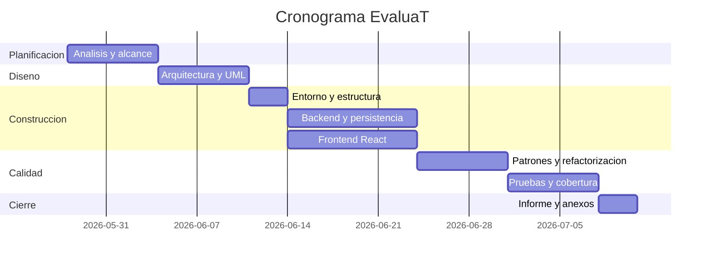
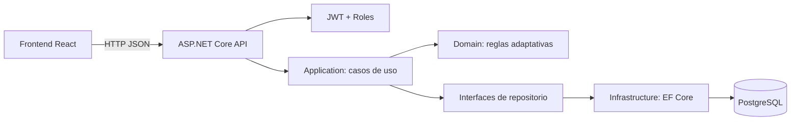
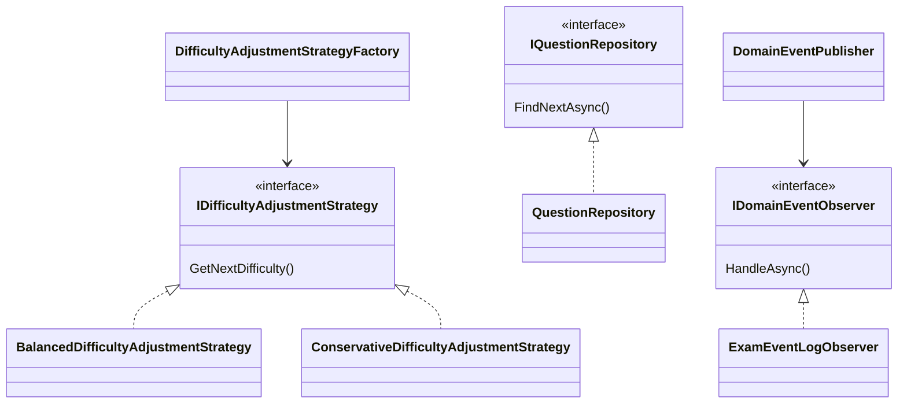

# Informe Técnico: EvaluaT

## 1. Introducción

**Contexto general del proyecto:**
EvaluaT es una línea de producto de software diseñada para gestionar y aplicar exámenes adaptativos. En el entorno educativo actual, la personalización de la evaluación es fundamental para medir de forma precisa y eficiente el conocimiento del estudiante, ajustándose a su nivel a medida que responde.

**Problema identificado:**
Los exámenes tradicionales estáticos a menudo no logran medir con exactitud el nivel real de conocimiento, frustrando a los estudiantes con menor dominio del tema y no representando un reto para los más avanzados. Además, gestionar grandes bancos de preguntas y analizar los resultados manualmente supone una gran carga laboral para los docentes.

**Objetivos del proyecto:**
- Desarrollar un sistema de exámenes adaptativos donde la dificultad de las preguntas se ajusta dinámica y automáticamente según las respuestas previas del estudiante.
- Proveer un panel administrativo para que los docentes gestionen el banco de preguntas, configuren las políticas de adaptación y monitoreen los resultados de las sesiones.
- Implementar una plataforma robusta, escalable y segura utilizando una arquitectura limpia, separando claramente los roles de usuario (`Teacher` y `Student`).

**Importancia del informe:**
Este informe técnico es fundamental porque establece las bases metodológicas, arquitectónicas y de planificación del proyecto EvaluaT. Sirve como guía principal para el equipo de desarrollo, justificando las decisiones de diseño, los patrones utilizados y asegurando que se cumplan tanto los requisitos funcionales como los estándares de calidad esperados.

## 2. Planificación del Proyecto

El desarrollo del proyecto EvaluaT se organizará bajo un enfoque modular y estructurado antes de iniciar la etapa de codificación. La planificación asegura que todos los requisitos sean entendidos, y que el esfuerzo se distribuya adecuadamente entre los componentes del sistema (Frontend, Backend, y Base de Datos).

El proyecto, de una duración estimada controlada, se divide en iteraciones que van desde el diseño temprano y establecimiento de la arquitectura base, seguido del desarrollo de los casos de uso principales, para finalmente cerrar con las fases de refactorización, control de calidad y despliegue local mediante contenedores.

### 2.1 Alcance (EDT — Estructura de Desglose del Trabajo)

El alcance del proyecto cubre la creación integral de la aplicación web EvaluaT. A continuación, se presenta cómo se descompone el trabajo en los entregables principales:

```text
1. EvaluaT
|-- 1.1 Gestión y Planificación
|   |-- 1.1.1 Análisis de Requisitos y EDT
|   |-- 1.1.2 Arquitectura y Diseño del Sistema
|
|-- 1.2 Desarrollo Backend (ASP.NET Core API)
|   |-- 1.2.1 Configuración de Infraestructura y Base de datos (PostgreSQL)
|   |-- 1.2.2 Módulo de Seguridad (Autenticación JWT, Roles Estudiante/Docente)
|   |-- 1.2.3 Gestión del Banco de Preguntas (CRUD)
|   |-- 1.2.4 Lógica de Dominio del Examen Adaptativo (Motor de ajuste de dificultad)
|
|-- 1.3 Desarrollo Frontend (React, TypeScript, Vite)
|   |-- 1.3.1 Login Seguro y Enrutamiento por Roles
|   |-- 1.3.2 Panel Docente (Gestión de preguntas y resultados)
|   |-- 1.3.3 Panel Estudiante e Interfaz del Examen Adaptativo
|
|-- 1.4 Calidad y Pruebas
|   |-- 1.4.1 Pruebas Unitarias del Motor Adaptativo y Dominio
|   |-- 1.4.2 Pruebas de Integración y Mocks (SQLite en memoria / Coverlet)
|   |-- 1.4.3 Revisión de Código y Aplicación de Patrones de Diseño
|
`-- 1.5 Documentación y Conformidad
    |-- 1.5.1 Informe Técnico y Diagramas (Arquitectura, Cronogramas)
    |-- 1.5.2 Documentación de Refactorización y Pruebas
```

### 2.2 Estimacion de costos

| Actividad | Horas |
| --- | ---: |
| Analisis y planificacion | 8 |
| Diseno de arquitectura | 10 |
| Desarrollo CRUD/API | 24 |
| Motor adaptativo y patrones | 12 |
| Refactorizacion documentada | 8 |
| Pruebas | 10 |
| Documentacion | 6 |
| Total | 78 |

### 2.3 Cronograma Gantt



## 3. Metodología de desarrollo

Para la construcción de EvaluaT, es fundamental elegir un marco de trabajo que se adapte a su alcance cerrado, sus requerimientos específicos y la duración controlada del proyecto. Se evaluaron dos enfoques principales: el modelo tradicional en Cascada y un marco de trabajo Ágil (Scrum Ligero).

### 3.1 Tabla Comparativa de Metodologías

| Metodología | Ventajas | Limitaciones | Idoneidad para EvaluaT |
| :--- | :--- | :--- | :--- |
| **Cascada (Waterfall)** | - Fases claramente definidas, secuenciales y bien documentadas.<br>- Fácil de planificar y presupuestar desde el inicio.<br>- Ideal cuando los requisitos no van a mutar. | - Escasa flexibilidad a cambios tardíos.<br>- El software completamente funcional se entrega al final de la línea de tiempo. | **Alta:** El proyecto cuenta con requisitos estables y el número de políticas de evaluación adaptativa ya está cerrado (`Balanced` y `Conservative`). |
| **Agilidad (Ej. Scrum)** | - Desarrollo iterativo e incremental.<br>- Permite ajustes rápidos a requerimientos cambiantes. | - Sobrecarga de roles, reuniones (ceremonias) y planeaciones que no justifican el tamaño del proyecto. | **Baja:** La complejidad de los requerimientos y el alcance no varían lo suficiente para justificar iteraciones y cambios constantes de rumbo. |

### 3.2 Justificación de la Elección: Cascada (Waterfall)

Se seleccionó la **Metodología en Cascada** como enfoque rector para el proyecto por las siguientes razones:

1. **Requisitos Estáticos y Bien Definidos:** La lógica adaptativa central no cambiará de rumbo a medio proyecto. Solo se requieren dos estrategias de dificultad específicas y claramente detalladas. No hay "peticiones sorpresa" durante el ciclo de vida.
2. **Documentación Clara y Entregables Previos:** En entornos formativos o comerciales con fechas de entrega inamovibles, Cascada favorece terminar la diagramación arquitectónica previa antes de escribir la primera línea de código, evitando retrabajos estructurales.
3. **Escala y Esfuerzo Fijo:** El proyecto está cronometrado a 78 horas estimadas de cierre; avanzar por las fases de *Diseño* -> *Construcción* -> *Pruebas* es lineal y predictible, haciendo innecesaria una gestión iterativa.
4. **Sinergia con Prácticas de Ingeniería Estables:** Permite diseñar los tests para pruebas unitarias de manera estructurada una vez concluida la etapa de análisis de requerimientos del motor.

## 4. Descripcion del caso de estudio

El docente controla el banco de preguntas y consulta resultados. El estudiante inicia una sesion de examen. El sistema entrega una pregunta inicial segun la politica seleccionada. Cada respuesta recalcula la dificultad siguiente y selecciona una nueva pregunta no repetida hasta completar la sesion.

## 5. Arquitectura del sistema



## 6. Reutilizacion de componentes

| Componente | Ubicacion | Reutilizacion |
| --- | --- | --- |
| `DifficultyBadge` | `frontend/src/App.tsx` | Etiqueta reutilizable para banco, pregunta y resumen |
| `Metric` | `frontend/src/App.tsx` | Muestra indicadores de sesion |
| `IQuestionRepository` | `backend/src/EvaluaT.Application/Abstractions` | Contrato reusable para API, pruebas y persistencia |
| `IDifficultyAdjustmentStrategy` | `backend/src/EvaluaT.Domain/Exams` | Permite agregar nuevas politicas sin tocar el caso de uso |
| `ExceptionHandlingMiddleware` | `backend/src/EvaluaT.Api/Middleware` | Manejo uniforme de errores HTTP |
| `JwtTokenGenerator` | `backend/src/EvaluaT.Api/Auth` | Emision reusable de tokens para usuarios autenticados |

## 7. Refactorizacion aplicada

### Extract Method

Antes:

```csharp
// La seleccion de pregunta estaba mezclada dentro del caso de uso.
var question = await _questions.FindNextAsync(nextDifficulty, answeredIds, cancellationToken);
if (question is null) { /* buscar alternativas */ }
```

Despues:

```csharp
var nextQuestion = await FindQuestionWithFallbackAsync(nextDifficulty, answeredQuestionIds, cancellationToken);
```

Justificacion: reduce duplicacion y aisla la busqueda con fallback.

### Replace Conditional with Strategy

Antes:

```csharp
if (policy == "Balanced") { /* subir o bajar */ }
else if (policy == "Conservative") { /* esperar dos aciertos */ }
```

Despues:

```csharp
var strategy = _strategyFactory.Create(session.Policy);
var nextDifficulty = strategy.GetNextDifficulty(context);
```

Justificacion: permite extender politicas sin modificar el servicio principal.

### Extract Interface

Antes:

```csharp
// El servicio dependia directamente de EF Core.
private readonly EvaluaTDbContext _dbContext;
```

Despues:

```csharp
private readonly IQuestionRepository _questions;
private readonly IExamSessionRepository _sessions;
```

Justificacion: desacopla Application de Infrastructure y facilita pruebas.

## 8. Patrones de diseno implementados



| Patron | Ubicacion | Intencion |
| --- | --- | --- |
| Strategy | `IDifficultyAdjustmentStrategy` | Variar el algoritmo de dificultad |
| Factory | `DifficultyAdjustmentStrategyFactory` | Crear la estrategia segun politica |
| Repository | `IQuestionRepository`, `QuestionRepository` | Encapsular acceso a datos |
| Observer | `IDomainEventObserver`, `DomainEventPublisher` | Reaccionar a eventos de dominio |
| Singleton | Registro DI de estrategias y reloj | Compartir servicios sin estado |
| Proxy/Guard | `[Authorize(Roles=...)]` | Controlar acceso a operaciones por rol |

## 9. Pruebas de calidad

| Tipo | Archivo | Caso |
| --- | --- | --- |
| Unitaria | `DifficultyStrategyTests.cs` | Ajuste de dificultad balanceado y conservador |
| Unitaria | `QuestionTests.cs` | Validacion de opciones correctas |
| Unitaria | `ExamSessionTests.cs` | Cierre de sesion y puntaje |
| Integracion/Aceptacion | `ExamFlowTests.cs` | Crear estudiante, iniciar examen y responder |

Resultado local:

- Pruebas: 7/7 correctas.
- Cobertura de lineas: 74,59%.
- Cobertura de ramas: 44,17%.

## 10. Conclusiones y retrospectiva

La separacion frontend/backend y la arquitectura por capas hacen visible la reutilizacion. El motor adaptativo queda preparado para crecer mediante nuevas estrategias de dificultad sin modificar la API ni la persistencia.

## 11. Anexos

- Frontend: `frontend/`
- Backend: `backend/`
- Docker PostgreSQL: `docker-compose.yml`
- Reporte de cobertura: `backend/tests/EvaluaT.Tests/TestResults/**/coverage.cobertura.xml`
